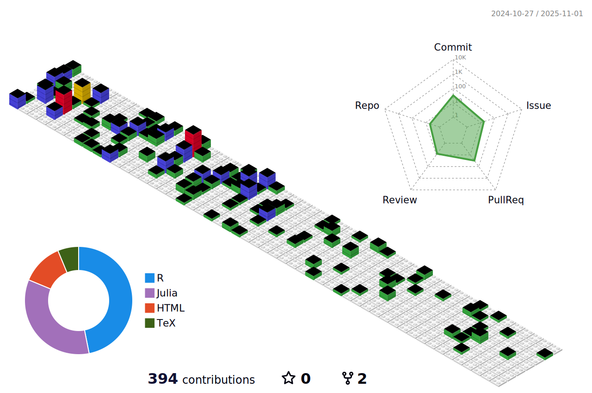

# Welcome to my GitHub profile!
I'm a psychology + mathematics student living in Berlin, and research assistant at the [Max Planck Institute for Human Development](https://www.mpib-berlin.mpg.de/en).
If you are here for our structural equation modeling julia package, you can find it [here](https://github.com/StructuralEquationModels/StructuralEquationModels.jl).

🌱 I’m currently learning about multitask deep learning.

📫 How to reach me: ernst@mpib-berlin.mpg.de

💬 Ask me about philosophy of science, statistics, or why I love [julia](https://julialang.org/).

🔭 I’m currently working on voxel wise neuroimaging analysis.

